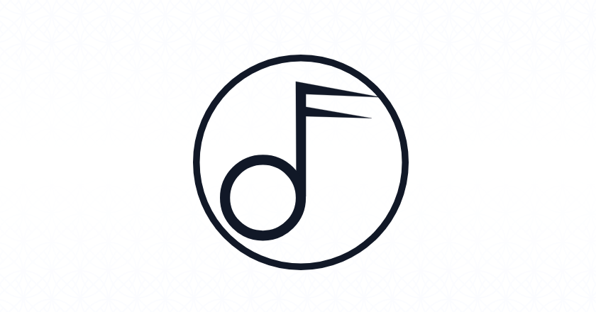

# Bassform - VILT SSR

VILT stack template app for PHP 8.2.x|8.3.x created by Musimana. Features include server-side rendering (SSR) and Larastan, Pest & Dusk test suites.

[Vue3](https://vuejs.org/),
[Inertia](https://inertiajs.com/),
[Laravel 11.x](https://laravel.com/docs),
[Tailwind 3.x](https://tailwindcss.com/docs)

This project is based on Breeze, with an opinionated style that aims to simplify creating new instances. On top of the Breeze scaffolding,
the template includes many additional scripts suitable for a variety of vanilla builds, with pointers for adding more advanced functionality.

## Installation

See the [installation instructions](.docs/INSTALL.md) to get the project set-up locally.

## Project CLI Commnds

See the [console docs](.docs/CONSOLE.md) for details of common commands for the project, including compiling the assets & seeding content.

## Contributing

See the [info on contributing](.docs/CONTRIBUTING.md) if you would like to submit a PR for the project.

## Testing

See the [testing docs](.docs/TESTING.md) for info on running the project's test suite.

## Releases

See the [release instructions](.docs/RELEASE.md) for info on releases & running deployments.

### Backwards Compatibility

Since the repo is offered as a template, it is offered on the basis that once an instance of it has been generated,
there will be no attempts to maintain backwards compatibility between the instance and this repo.
This means you are free to use the generated instance however you wish,
but that there is no native mechanism for updating any given instance to match later versions of this template repository.

For more info on this see the [Versioning Policy](.docs/RELEASE.md#versioning-policy).

## License

Both this app and the Laravel framework are open-source software, licensed under the [MIT license](https://opensource.org/licenses/MIT).
